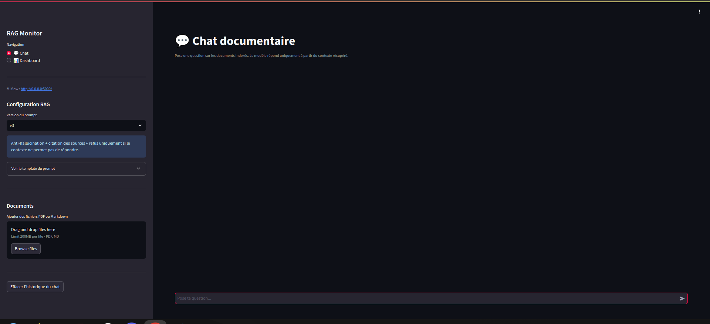
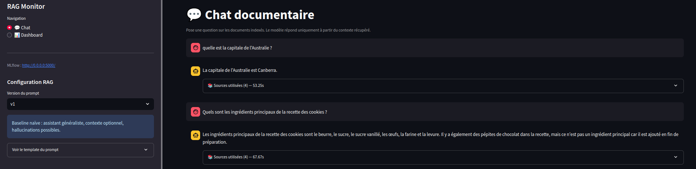
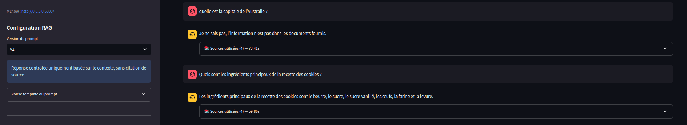
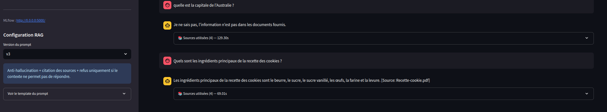
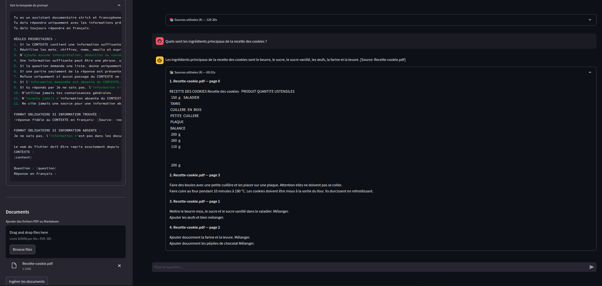
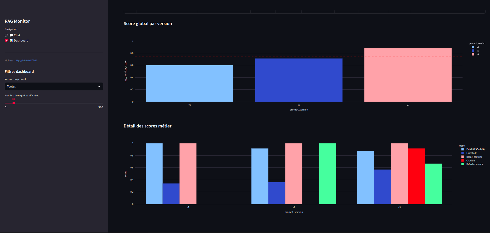
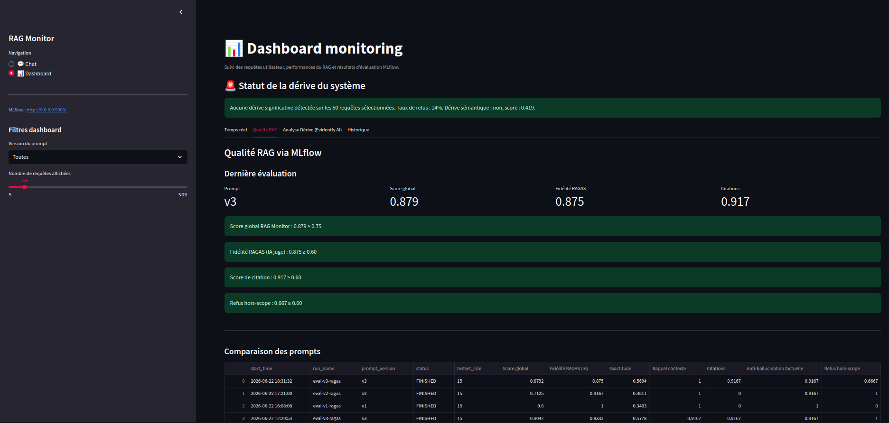
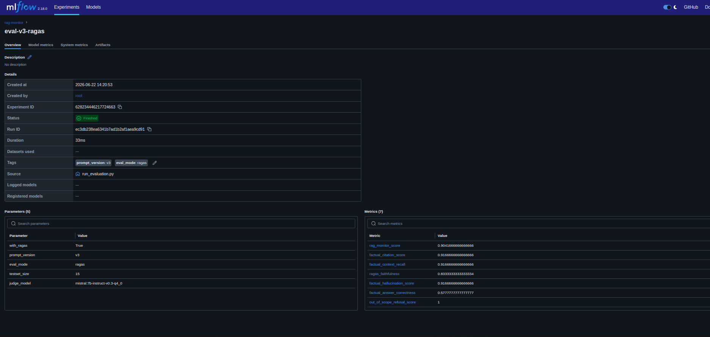
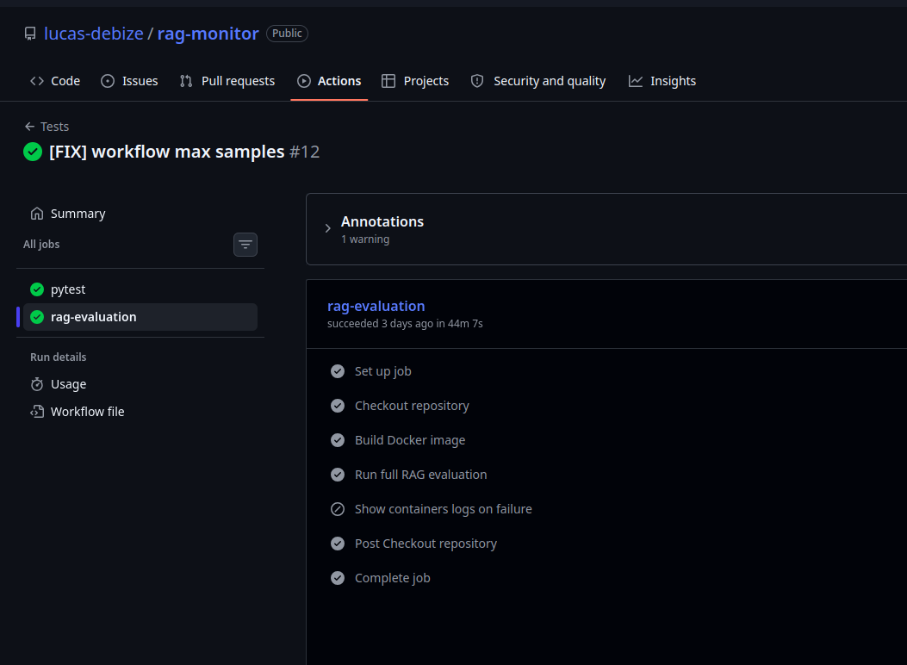

# RAG Monitor - Système de Question-Réponse avec Monitoring

Un système complet de question-réponse basé sur la Génération Augmentée par Récupération (RAG) avec monitoring de la dérive, versioning des expériences et une architecture entièrement conteneurisée. Conçu pour fonctionner localement avec un LLM libre, **tout se lance en une seule commande** 🚀

## 📋 Table des matières

1. [Présentation du projet](#présentation-du-projet)
2. [Installation et lancement](#installation-et-lancement)
3. [Architecture et composants](#architecture-et-composants)
4. [Guide d'utilisation](#guide-dutilisation)
5. [Structure du projet](#structure-du-projet)
6. [Configuration avancée](#configuration-avancée)

---

## 🎯 Présentation du projet

**RAG Monitor** est une plateforme complète d'intelligence artificielle qui combine :

- **Système RAG** : Un pipeline de question-réponse intelligent qui récupère les informations pertinentes dans vos documents avant de générer une réponse
- **Modèles locaux** : Utilisation d'Ollama pour exécuter des LLM libres (Mistral, Qwen) sans dépendre de services externes
- **Monitoring** : Surveillance en temps réel de la qualité des réponses et détection des dérives en performance
- **Expérimentation** : Versioning complet des modèles, prompts et résultats via MLflow
- **Interface utilisateur** : Dashboard Streamlit pour interagir avec le système et analyser les métriques

## Démo vidéo

[](asset/demo.mp4)

> 🎬 Cliquez sur l'image ci-dessus pour télécharger/visionner la démo (`asset/demo.mp4`).

### Cas d'usage

- 📚 Chatbot Q&A sur des documents personnalisés
- 🔍 Extraction et résumé d'informations
- 📊 Analyse des performances et identification des anomalies
- 🧪 Expérimentation avec différentes configurations de prompts et modèles
- 📈 Évaluation de la qualité des réponses générées

---

## ⚙️ Installation et lancement

### Prérequis

- **Docker** et **Docker Compose** (version 1.29+)
- **4 GB RAM minimum** (recommandé : 8 GB pour les modèles LLM)
- **10 GB d'espace disque** (pour les modèles et la base de données)

### Lancement rapide

```bash
# Cloner le projet
git clone https://github.com/lucas-debize/rag-monitor.git
cd rag-monitor

# Lancer tout le système en une seule commande (peut nécessiter usage sudo : sudo docker compose up --build)
docker compose up --build
```

C'est tout ! Cette commande va automatiquement :

1. 🐳 Démarrer **Ollama** et télécharger les modèles (Mistral, Qwen)
2. 📊 Initialiser **MLflow** pour le suivi des expériences
3. 📝 Ingérer les documents et créer la base vectorielle ChromaDB
4. 🔄 Lancer les évaluations de version (v1, v2, v3)
5. 🎨 Démarrer l'interface **Streamlit** sur http://localhost:8501

### Arrêt du système

```bash
# Arrêter tous les containers
docker compose down
```

---

## 🏗️ Architecture et composants

### Vue d'ensemble de l'architecture

```
┌─────────────────────────────────────────────────────────────┐
│                    Streamlit UI (8501)                      │
│        Chat • Upload de documents • Dashboard                │
└────────────────────┬────────────────────────────────────────┘
                     │
┌────────────────────┴─────────────────┬──────────────────────┐
│                                      │                      │
│         Pipeline RAG                 │   MLflow (5000)      │
│  ┌────────────────────────────────┐  │  ┌────────────────┐  │
│  │  1. Récupération (ChromaDB)    │  │  │ Tracking des   │  │
│  │  2. Génération (Ollama LLM)    │  │  │ expériences    │  │
│  │  3. Evaluation (RAGAS)         │  │  │ Metrics        │  │
│  │  4. Monitoring (Evidently AI)  │  │  │ Artifacts      │  │
│  └────────────────────────────────┘  │  └────────────────┘  │
│                                      │                      │
└──────────┬──────────────────────────────────┬────────────────┘
           │                                  │
      ┌────▼─────┐                      ┌─────▼──────┐
      │  ChromaDB │                      │   Ollama   │
      │  (11434)  │                      │  (11434)   │
      │ Base de   │                      │ Mistral    │
      │ données   │                      │ Qwen2.5    │
      │ vectoriel │                      │ Modèles    │
      └───────────┘                      └────────────┘
```

### Composants principaux

#### 🤖 **Ollama** - Moteur LLM local
- **Port** : 11434
- **Modèles** : 
  - `mistral:7b-instruct-v0.3-q4_0` (primaire)
  - `qwen2.5:7b-instruct` (alternatif)
- Quantifié en Q4 pour minimiser la consommation mémoire
- Téléchargement automatique au démarrage

#### 🗄️ **ChromaDB** - Base de données vectorielle
- Stockage persistant des embeddings des documents
- Collection : `rag_documents`
- Embedding model : `sentence-transformers/all-MiniLM-L6-v2`
- Permet une recherche rapide et pertinente des contextes

#### 🔗 **LangChain** - Orchestration RAG
- Chaîne de traitement : Document → Embedding → Récupération → Génération
- Gestion des prompts et templates
- Intégration des différentes briques (LLM, vectorstore, retrievers)

#### 📊 **MLflow** - Suivi des expériences
- **Port** : 5000
- **UI** : http://localhost:5000
- Versioning des configurations de prompts
- Logging des métriques et artefacts
- Historique complet des exécutions

#### 📈 **Evidently AI** - Monitoring de dérive
- Détection automatique de dérives en performance
- Rapport HTML généré
- Métriques suivies : taux de refus, qualité des réponses

#### 🎓 **RAGAS** - Évaluation de qualité
- Évaluation automatisée des réponses RAG
- Métriques : 
  - `faithfulness` (fidélité aux sources)
  - `answer_relevance` (pertinence de la réponse)
  - `context_recall` (rappel du contexte)
  - `context_precision` (précision du contexte)
- Versions d'évaluation : v1, v2, v3 (comparaison de prompts)

#### 🎨 **Streamlit** - Interface utilisateur
- **Port** : 8501
- **URL** : http://localhost:8501
- Interface réactive et intuitive
- Onglets : Chat, Upload, Analytics, Monitoring

---

## 🖼️ Captures d'écran

### Comparaison des versions de prompt

#### v1 — Question / réponse


#### v2 — Question / réponse


#### v3 — Question / réponse


#### Ingestion des documents et explication de l'IA + contenu source


### Interfaces de suivi

#### Dashboard principal


#### Rapport de drift


#### MLflow


#### Github Actions


---

## 📖 Guide d'utilisation

### 1️⃣ Chat et questions-réponses

1. **Accéder à l'interface** : Ouvrir http://localhost:8501
2. **Onglet "Chat"** : 
   - Entrez votre question dans le champ de saisie
   - L'application récupère le contexte pertinent des documents
   - Génère et affiche la réponse avec les sources

**Exemple de question** :
```
"Quels sont les principaux défis du projet ?"
"Que recommandez-vous pour améliorer la performance ?"
```

### 2️⃣ Upload de documents

1. **Onglet "Upload de documents"**
2. **Formats supportés** : PDF, Markdown, Text
3. **Processus** :
   - Sélectionnez vos fichiers
   - Cliquez sur "Ingérer les documents"
   - L'application :
     - Parse les documents
     - Les découpe en chunks
     - Crée les embeddings
     - Les indexe dans ChromaDB

**Points importants** :
- Les documents sont stockés dans `/data/documents/`
- Chaque document est fragmenté en chunks de 500 tokens (configurable)
- La vectorisation est automatique

### 3️⃣ Dashboard de Monitoring

**Onglet "Analytics & Monitoring"** offre une vue complète :

#### 📊 Métriques principales
- **RAG Monitor Score** : Score global de qualité (0-1)
- **Faithfulness** : % de réponses fidèles aux sources avec juge ia ragas
- **Answer Correctness** : Exactitude de la réponse
- **Citation Score** : Qualité de la citation des sources
- **Refusal Score** : Capacité à refuser quand nécessaire

#### 📈 Graphiques et tableaux
- Évolution des métriques dans le temps
- Distribution des scores
- Détection des anomalies (points rouges = alerte)
- Comparaison entre versions de prompts (v1, v2, v3)

#### 🚨 Rapport de dérive
- Lien direct au rapport Evidently AI
- Détection automatique des dérives
- Recommandations pour ajuster les prompts

### 4️⃣ Dashboard MLflow (Suivi des expériences)

**Accès** : http://localhost:5000

Visualisez :
- Toutes les runs d'évaluation avec leurs paramètres
- Les métriques enregistrées
- Les artefacts (fichiers CSV, JSON)
- Comparaison entre différentes configurations

---

## 📁 Structure du projet

```
rag-monitor/
├── docker-compose.yml          # Orchestration des services
├── Dockerfile                  # Image Docker personnalisée
├── requirements.txt            # Dépendances Python
├── README.md                   # Ce fichier
│
├── src/                        # Code principal
│   ├── streamlit_app.py        # Interface utilisateur
│   ├── rag_pipeline.py         # Pipeline RAG (retrieval + generation)
│   ├── ingestion.py            # Ingestion et indexation des documents
│   ├── evaluator.py            # Évaluation RAGAS des réponses
│   ├── drift_monitoring.py     # Monitoring de dérive (Evidently AI)
│   ├── mlflow_tracker.py       # Suivi des expériences
│   ├── prompts.py              # Gestion des templates de prompts
│   ├── metrics_logger.py       # Logging des métriques
│   ├── run_evaluation.py       # Script d'évaluation
│   └── connection_check.py     # Vérification des connexions
│
├── data/                       # Données persistantes
│   ├── documents/              # Documents uploadés
│   ├── chroma_db/              # Base de données vectorielle
│   ├── eval_results/           # Résultats des évaluations
│   ├── metrics/                # Fichiers de métriques CSV
│   ├── testset/                # Ensemble de test pour évaluation
│   └── drift_report.html       # Rapport de dérive
│
├── mlruns/                     # Données MLflow
│   └── 628234446217724663/     # Experiment ID
│
└── tests/                      # Tests unitaires
    ├── test_ingestion.py
    ├── test_metrics_logger.py
    └── test_prompts.py
```

---

## ⚙️ Configuration avancée

### Variables d'environnement

Vous pouvez personnaliser le comportement en modifiant les variables dans `docker-compose.yml` :

```yaml
# Modèles et LLM
MODEL_NAME=mistral:7b-instruct-v0.3-q4_0
JUDGE_MODEL=mistral:7b-instruct-v0.3-q4_0
OLLAMA_BASE_URL=http://ollama:11434

# Prompt et RAG
PROMPT_VERSION=v2           # Version du prompt (v1, v2, v3)
RETRIEVER_TOP_K=5           # Nombre de chunks récupérés
CHUNK_SIZE=500              # Taille des chunks en tokens
CHUNK_OVERLAP=50            # Chevauchement entre chunks
LLM_TEMPERATURE=0.0         # Température (0=déterministe, 1=créatif)

# Évaluation RAGAS
RAGAS_TIMEOUT=1800          # Timeout en secondes
RAGAS_MAX_WORKERS=1         # Nombre de workers parallèles
RAGAS_MAX_RETRIES=3         # Tentatives en cas d'erreur
RAGAS_MAX_SAMPLES=0         # 0 = tous les samples

# Monitoring
RAG_MONITOR_THRESHOLD=0.75
ANSWER_CORRECTNESS_THRESHOLD=0.50
FAITHFULNESS_THRESHOLD=0.6
```

### Utiliser un autre modèle

Pour remplacer Mistral par Qwen :

```bash
# Éditer docker-compose.yml
MODEL_NAME=qwen2.5:7b-instruct
JUDGE_MODEL=qwen2.5:7b-instruct

# Redémarrer
docker compose up --build
```

### Désactiver l'évaluation automatique

Pour les tests rapides, commentez la ligne dans `docker-compose.yml` :

```yaml
# command: sh -c "python src/ingestion.py && python -m src.run_evaluation --versions v1 v2 v3"
command: sh -c "python src/ingestion.py"
```

---

## 🧪 Tests"""""""""""""""""""""""""""""""""""""""""""""""""""""

```bash
# Réévaluer l'ia après modification des prompts ou changement de modèle sur toute ces versions
docker compose run --rm app python -m src.run_evaluation --versions v1 v2 v3
```

---

## 📝 Licence

Ce projet est fourni à titre informatif pour des fins de démonstration et d'apprentissage.

---
